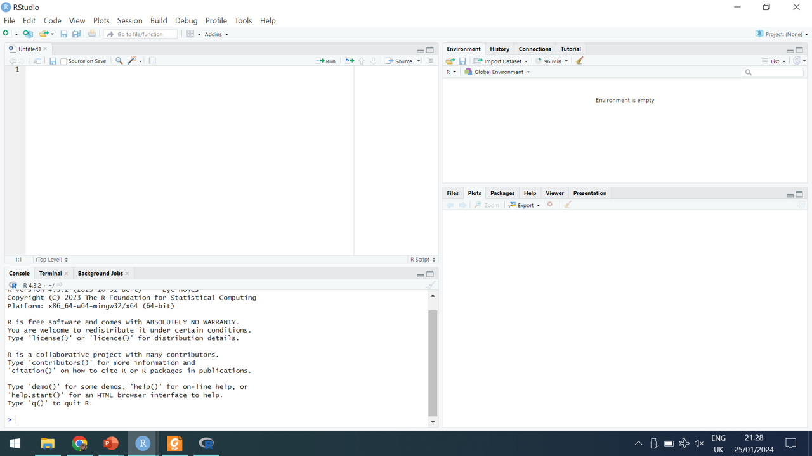
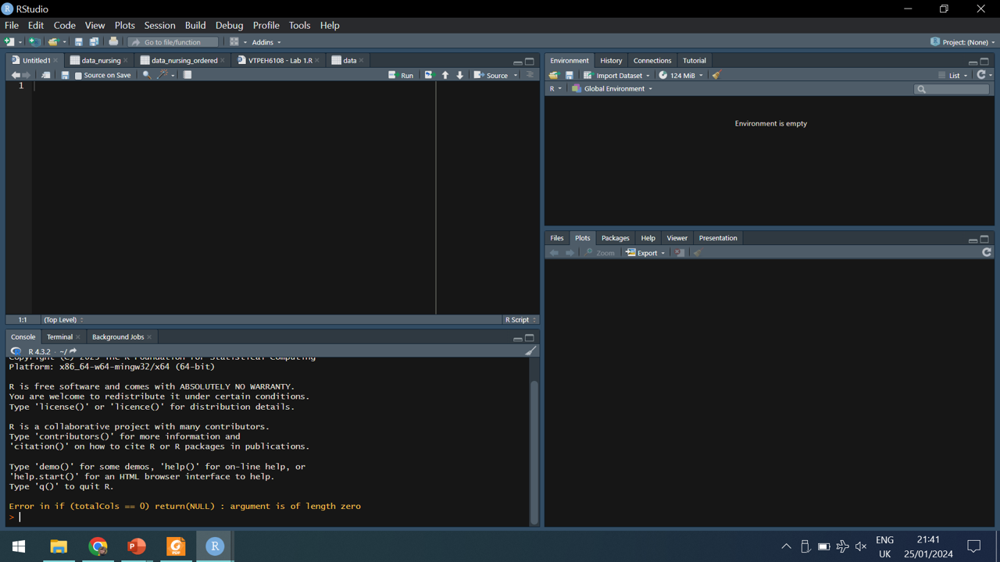
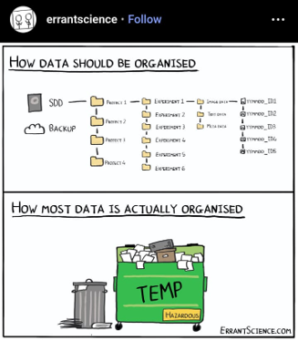

```{r setup, include = FALSE}

knitr::opts_chunk$set(echo = TRUE, warning = FALSE, message = FALSE)

```

# Introduction

*What is R?*

**R** is a **programming language** for **statistical computing**. R includes built-in functions and libraries to format and visualize data, fit statistical models, build predictive models, etc...  
R is generally used via **RStudio**, an integrated development environment (or IDE) for R. RStudio includes for instance a code editor, a file browser, an environmental browser and graphic visualization tools. 

*Why are we learning R as part of this program?*
As part of your training and career in Public and Ecosystem Health, you will likely use R to analyze data or model epidemiological processes, among other things.  
The objective of the R classes is twofold: 

1. Build your **intrinsic motivation to learn programming** with the R environment through Activitys.  
2. Get yourself **familiarized with the R environment in practical sessions** focused on data analyses with statistical tools.  

# Installing R and RStudio

To use R in class, you will need a laptop with R and RStudio installed. Both R and RStudio are available for **free** to anyone.

To start using R and RStudio, follow these steps:

1. **Download R**
   - Go to the Comprehensive R Archive Network (CRAN): [cran.r-project.org](https://cran.r-project.org/).
   - Download the R version that matches your operating system and install it.

2. **Download RStudio**
   - Go to the RStudio website: [posit.co/download/rstudio-desktop](https://posit.co/download/rstudio-desktop/).
   - Download the RStudio Desktop version that matches your operating system and install it.

3. **Verify Installation**
   - Open RStudio.
   - Check if the Console window is working by typing `1 + 1` and pressing Enter. It should return `2`.
   
PS: if you do not own a laptop able to run the latest version of RStudio, you can borrow a computer from the university library (more information at [olinuris.library.cornell.edu/equipment](https://olinuris.library.cornell.edu/equipment)).

# RStudio Interface

RStudio is an integrated development environment (IDE) for R. It provides a user-friendly interface for coding, data analysis, and visualization. 



RStudio has four main windows:

***Source or Script Pane (Top-Left)***
  
- Purpose - This is where you write and edit scripts (e.g., `.R`).
- Features
  - Syntax highlighting for R code.
  - Auto-complete suggestions.
  - Code execution shortcuts (`Ctrl + Enter` or `Cmd + Enter` to run lines).
  - Code can be saved into a script.

***Console (Bottom-Left)***

- Purpose - The Console is where R commands are executed interactively.
- Features
  - Direct input for quick testing of operations and other commands.
  - Displays results and error messages.

  ```{r}

  # Type directly into the console
  1 + 1  # Press Enter to see the result
  
  ```

***Environment/History Pane (Top-Right)***

- ***Environment Tab***
  - Displays all active objects (e.g., data frames, variables, functions).
  - Use this to keep track of your workspace.
  - Clear the workspace using `rm(list = ls())`.
  
  ```{r}

  # Type directly into the console
  a = 1  # Press Enter to see the result
  
  ```

- ***History Tab***
  - Logs all executed commands.
  - Allows re-running previous commands by clicking on them.

***Files/Plots/Packages/Help/Viewer Pane (Bottom-Right)***

- ***Files Tab***
  - Navigate your working directory and manage files.

- ***Plots Tab*** 
  - Displays visualizations generated in your R session.

  ```{r}

  plot(1:10, 101:110)
  
  ```
    
- ***Packages Tab***
  - Manage R packages: install, load, or update.

  ```{r} 

  #install.packages("ggplot2") # Install package on your computer directly from CRAN
  library(ggplot2) # Load package into this R session
  
  ```
    
- ***Help Tab***
  - Access documentation for R functions and packages.
  - Example: type `?mean` in the Console or use the search bar.
  
- ***Viewer Tab***
  - Displays web content and interactive visualizations (e.g., `shiny` apps).

Customizing

You can adjust the layout, color theme, etc... of RStudio by going to `Tools > Global Options`.
  


# The Programming Workflow

1. Search
2. Copy-paste
3. **Check and adjust**
4. Repeat


# Note on the Use of Artificial Intelligence (AI)

Final product needs to be your product though
See [Cornell guidelines](https://it.cornell.edu/ai/ai-guidelines) on Confidentiality and Privacy, and Accountability when Using AI 
Need to understand what the code does
Need to verify what the code does

Ok now let's start coding...

# Organizing the Working Repository

To easily keep track of files (data, scripts, outputs...), create on your computer a **dedicate folder** for each new project. Do not keep everything in the Download, Temp or Desktop folder, as this would make difficult to go back to the project in the future, might lead to files being overwritten, etc.



# Loading Data

You can import comma-separated vector (CSV) files using `read.csv()`. CSV is the most convenient format to use. It is a lightweight, universally supported, human-readable, and highly compatible format ideal for storing and sharing tabular data efficiently across platforms and tools.

We will use the *Number of Reported Malaria Cases by County— United States, 2017* dataset available at [data.cdc.gov/Global-Health/Number-of-Reported-Malaria-Cases-by-County-United-/puzh-5wax/about_data](https://data.cdc.gov/Global-Health/Number-of-Reported-Malaria-Cases-by-County-United-/puzh-5wax/about_data). Download the CSV file onto your computer to be able to easily work with it. 

```{r}

# Load a CSV file
data_malaria = read.csv(
  "Data/Number_of_Reported_Malaria_Cases_by_County__United_States__2017_20250120.csv"
  )
# Notice the changes in the Environmental pane

# Preview the data
head(data_malaria)

```

To find the path of a file on your computer:

- *Windows*: right-click the file, select “Properties,” and copy the “Location” path. Add the file name to this path.
- *Mac*: right-click the file, select “Get Info,” and copy the “Where” path. Add the file name to this path.

## Activity

- Click on the data set *data* in the Environmental pane. Describe the data set.

```{r}

# Visualize data set
View(data_malaria)

```  


# Data Types

R uses different data types. 

You can assess the type of data you are working with using functions such as `class()`, `is.numeric()`, `is.character()`, `as.factor()`.

  ```r

  # Create different objects
  numeric_vector = c(1, 2, 3)  # Numeric vector
  char_vector = c("apple", "banana", "cherry")  # Character vector
  logical_vector = c(TRUE, FALSE, TRUE)  # Logical vector
  # Notice the changes in the Environmental pane

  # Check their types
  class(numeric_vector)
  typeof(logical_vector)
  # Notice the information displayed in the Environmental pane
  
  ```

You can convert data types using functions like `as.numeric()` or `as.factor()`. A factor in R is a data type used to represent categorical data. The source data can be of any type (numbers, character strings...). Using factors is a way of storing values that belong to a finite, predefined set of levels (categories). Factors are particularly useful when working with data that can be grouped or classified, such as gender, regions or cohorts.

  ```r

  # Convert a numeric vector to a factor
  factor_vector = as.factor(numeric_vector)
  class(factor_vector)
  # Notice the changes in the Environmental pane

  ```

# Object Types

We can create an object and assign it a value or a set of values using `=` or `<-`.

  ```r

  a = 2

  ```

Data are stored in objects, which can also be of different types.

***Vector***
A one-dimensional collection of elements of the same type (e.g., numeric, character, logical). We can create vectors using the `c()` function ("c" stands for "combine").

  ```r

  numeric_vector = c(1, 2, 3)  # Numeric vector
  char_vector = c("apple", "banana", "cherry")  # Character vector

  ```

***Matrix***
A two-dimensional rectangular array where all elements are of the same type.

  ```r

  matrix_example = matrix(1:9, nrow = 3, ncol = 3)
  print(matrix_example)

  ```

***Data Frame***
A two-dimensional table where columns can hold different types (e.g., numeric, character).

  ```r
  df_example = data.frame(
    id = 1:3,
    name = c("Alice", "Bob", "Charlie"),
    score = c(85, 90, 88)
  )
  print(df_example)
  ```
  
## Activity

  - What type of object is our data set *data*?  
  - What type of data is the *STATE* variable?  
  - What type of data is the *MAL_FREQ_2017* variable?  
  - What type of data is the *STATE_CODE_FIPS* variable?  
  - What type of data do you think the *STATE_CODE_FIPS* variable should be?  

# Object Structures

Objects are elements or group of elements. Elements can be individually called. For instance, we can call a specific position within a matrix or data frame with `[ , ]`, or a vector within a data frame with `$`.

  ```r
  
  matrix_example = matrix(1:9, nrow = 3, ncol = 3)
  # Call a position within a matrix
  matrix_example[1, 1]
  matrix_example[3, 3]

  ```
The order of the indexes is always row, column (which is hard to remember, but easy to check).

We can do so on real data sets. 
  
```{r}
# Call a position within a data frame
data_malaria[1, 3] # First county
data_malaria[1, 4] # Malaria case counts for the first county

# Call a vector
data_malaria$COUNTY # All the counties within the data set

# Call a position within a vector
data_malaria$COUNTY[1] # First county

```

## Activity

  - Extract the vector of malaria case counts by county
  - How can you transform the *STATE_CODE_FIPS* variable into a different type?  
  
```{r, include = FALSE}

# Insert answer here

```  
  
# Basic Syntax and Functions

Functions allow you to perform operations efficiently. The structure of a function is `function_name(argument_1, argument_2, ...)`. For pre-defined functions (within base R or a package), we can use `?function_name` to access the help documentation (notably to know which arguments it takes).

```{r}

# Access help documentation
?mean

```

## Activity

  - What is the formula of the mean? Calculate the mean of the vector `c(1, 2, 3)` manually and using the R function to do so.

```{r, include = FALSE}

# Insert answer here

```  

Google, AI tools or a colleague's scripts are usually the first place to look for a way to do what we want to do. 

## Activity

  - Calculate the mean and the standard deviation of malaria case counts across counties.
  - Calculate the quartiles of malaria case counts across counties.
  
```{r, include = FALSE}

# Insert answer here

```

# Exploring Data

We can explore and summarize data with functions like `summary()`, `unique()`, `table()`...

Data exploration helps understand the dataset structure and key statistics:

```{r}

# Example: Summary statistics
summary(data_malaria)

# Find unique values
unique(data_malaria$STATE)

# Create a contingency table
table(data_malaria$STATE) # Number of observations by state

```

# Plotting data

Visualization is always the first step of data exploration.

```{r}

# Histogram
hist(data_malaria$MAL_FREQ_2017)

# Barplot
barplot(data_malaria$MAL_FREQ_2017, 
        names.arg = data_malaria$COUNTY,
        ylab = "Malaria case count")

```

With `ggplot2`.

```{r}

# Load package
library(ggplot2)

# Histogram
ggplot(data_malaria, aes(x = MAL_FREQ_2017)) +
  geom_histogram()

# Improved version
ggplot(data_malaria, aes(x = MAL_FREQ_2017)) +
  geom_histogram() +
  xlab("Number of counties") +
  xlab("Number of malaria cases")

# Scatter plot
ggplot(data_malaria, aes(x = STATE, y = MAL_FREQ_2017)) +
  geom_point()

# Improved version
ggplot(data_malaria, aes(x = STATE, y = MAL_FREQ_2017)) +
  geom_point() +
  xlab("State") +
  xlab("Number of malaria cases") +
  theme(axis.text.x = element_text(angle = 45, hjust = 1))

```

## Activity

  - Create an histogram showing the distribution of the number of cases across states.
  - Create a boxplot showing the distribution of the number of cases across states.
  - Create a boxplot showing the distribution of the number of cases across counties, structured by state.
  - Create the same plot using the `ggplot2` package. Think about the plot you want to draw, and look for help from Google or AI. Improve it until presentable. 
  
```{r, include = FALSE}

# Insert answer here

```

# Generating Reports with RMarkdown

RMarkdown is a file format and framework for creating dynamic, reproducible documents that integrate text, code, and outputs (e.g., visualizations and tables) in a seamless way. 

## Activity

  - Using help from Google and/or AI as needed, create a PDF showing boxplot showing the distribution of the number of cases across counties, structured by state, and the code used to generate it. 
  
# Keeping the Data in Mind...

Reading the description of the data set on the source, discuss the plot. 

# Solutions to the activities

```{r}

# Extract the vector of malaria case counts by county
data_malaria$MAL_FREQ_2017

# How can you transform the *STATE_CODE_FIPS* variable into a different type?  
data_malaria$STATE_CODE_FIPS = as.factor(data_malaria$STATE_CODE_FIPS)

# What is the formula of the mean? Calculate the mean of the vector `c(1, 2, 3)` manually and using the R function to do so.
(1 + 2 + 3)/3
mean(c(1, 2, 3))

# Calculate the mean and the standard deviation of malaria case counts across counties.
mean(data_malaria$MAL_FREQ_2017)
sd(data_malaria$MAL_FREQ_2017)

# Calculate the quartiles of malaria case counts across counties.
quantile(data_malaria$MAL_FREQ_2017)

# Create a new data frame containing the information of the number of cases by state
data_malaria_state = aggregate(MAL_FREQ_2017 ~ STATE, data_malaria, sum)

# What does `data_malaria$MAL_FREQ_2017` do?
data_malaria$MAL_FREQ_2017
# Extract the vector containing the information about the number of malaria case per county

# Create an histogram showing the distribution of the number of cases across states.
hist(data_malaria_state$MAL_FREQ_2017)

# Create a boxplot showing the distribution of the number of cases across states
boxplot(data_malaria_state$MAL_FREQ_2017)

# Create a boxplot showing the distribution of the number of cases across counties, structured by state.
boxplot(data_malaria$MAL_FREQ_2017 ~ data_malaria$STATE)

# Create the same plot using the `ggplot2` package. 
ggplot(data_malaria, aes(x = STATE, y = MAL_FREQ_2017)) + 
  geom_boxplot() +
  xlab("State") +
  ylab("Malaria cases count") +
  theme(axis.text.x = element_text(angle = 45, hjust = 1))

```  

The End.